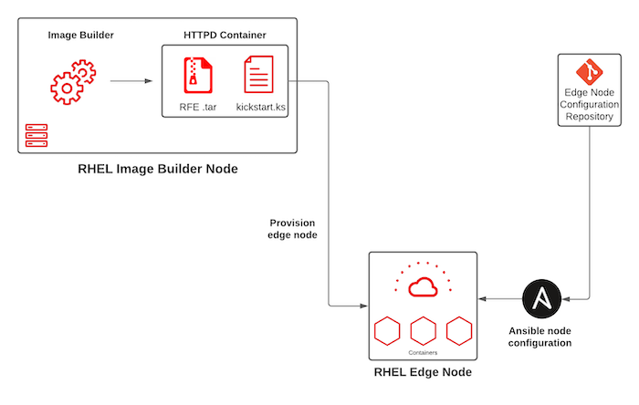

# rfe-mgmt-ansible

Ansible automation to provision an RHEL for Edge Environments
## Solution Overview

This approach focuses on the Ansible automation being driven through the execution directly on the edge node. Ansible RPM's are installed into the RFE image and executed as the node boots.



## Prerequisites
### Download dependencies

Execute the following commands to download the required dependencies

```
$ ansible-galaxy role install -r collections/requirements.yaml
```

### Populate Inventory

Add the Image Builder instance(s) into the [hosts](inventory/hosts) file.

### Subscription Information

The content within this repository leverages Red Hat RPM's. The automation to manage subscribing the machines and repositories makes use of the [rhsm](https://github.com/redhat-cop/infra-ansible/blob/master/roles/rhsm) role within the [infra-ansible](https://github.com/redhat-cop/infra-ansible) repository.

It is recommended to add the necessary values to a separate file and inject it in as an extra parameter using `-e @<filename>` when executing the playbook. An example can be found below:

```
---
rhsm_username: "<password>"
rhsm_password: "<username>"
```

You can choose to skip Ansible from managing subscription information by passing `-e rhsm_manage=false`. Be sure that the machine is subscribed to `ansible-2.9-for-rhel-8-x86_64-rpms` along with the default RHEL8 repositories.

## Provision

Execute the following command in order to provision the machine:

```
ansible-playbook -i inventory/ playbooks/image_builder.yaml
```

Once provisioning is complete, a HTTPD container that exposes the RFE image and kickstart file on port 8000.

## Edge Nodes

Since the above automation exposes the kickstart file and the edge image, boot the RHEL edge instance and add the kickstart arguments as follows:

```
inst.ks=http://<image_builder_node>:8000/kickstart.ks
```

## Edge Automation

The key attribute of this architecture is that edge instances configure themselves by executing Ansible automation. This automation lives on a in the `ansible-edge` branch of this repository. A timer systemd service is configured to execute the automation on a regular basis.
